# Image2STL - G-Code Generator

**Image to STL, Relief- and Engrave Milling G-Code Generator and Visualizer**

> **Source code is proprietary and available under a commercial license.** 
> Contact: [www.mycncmill.de](https://www.mycncmill.de)


Image2STL converts a grayscale image (or any image) into a 3-D height-field STL model and generates CNC milling G-Code for roughing and finishing passes.  
It visualizes the resulting tool path in 3-D, simulates the machining process step-by-step and shows a material-removal preview — all inside one desktop application.

**Follow & Support:**
- 🌐 Website: [www.mycncmill.de](https://www.mycncmill.de)
- 📱 Instagram: [@mycncmill.grbl](https://instagram.com/mycncmill.grbl)

---

---

## Screenshots

Planned update set for newly added features: [docs/README_SCREENSHOT_PLAN.md](docs/README_SCREENSHOT_PLAN.md)

### STL Model View

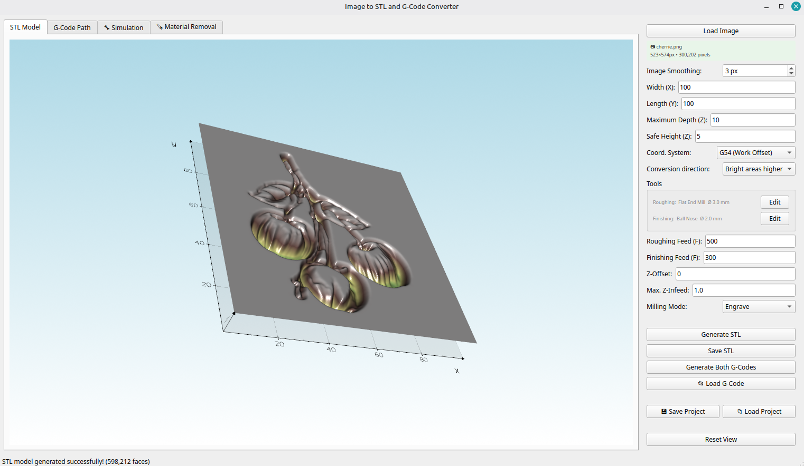

---

### Tool Dialog

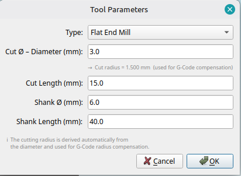

---

### G-Code Visualizer

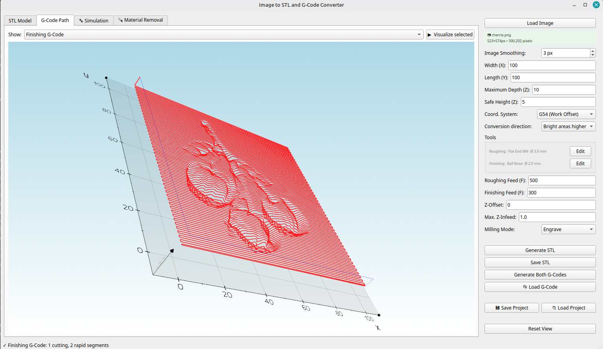

---

### NC Simulation

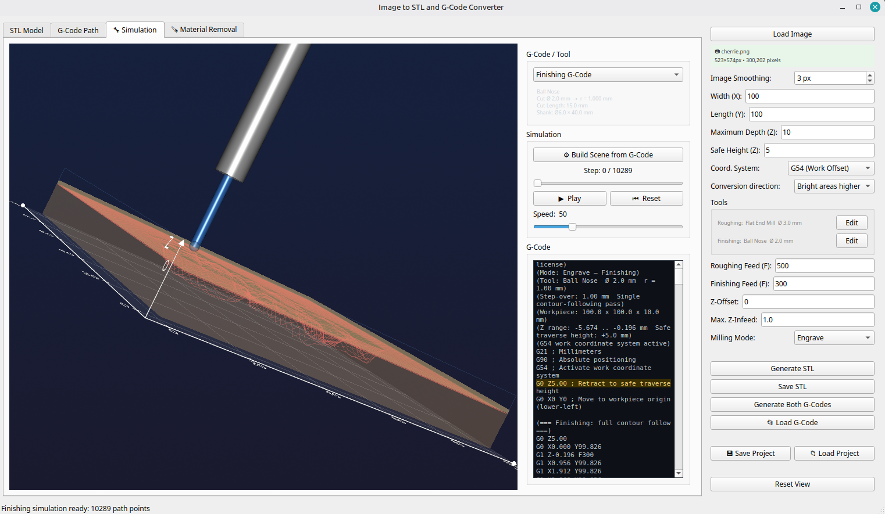

---

### Material Removal Simulation

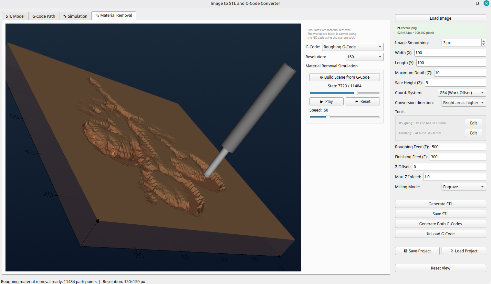

---

### Image Editor

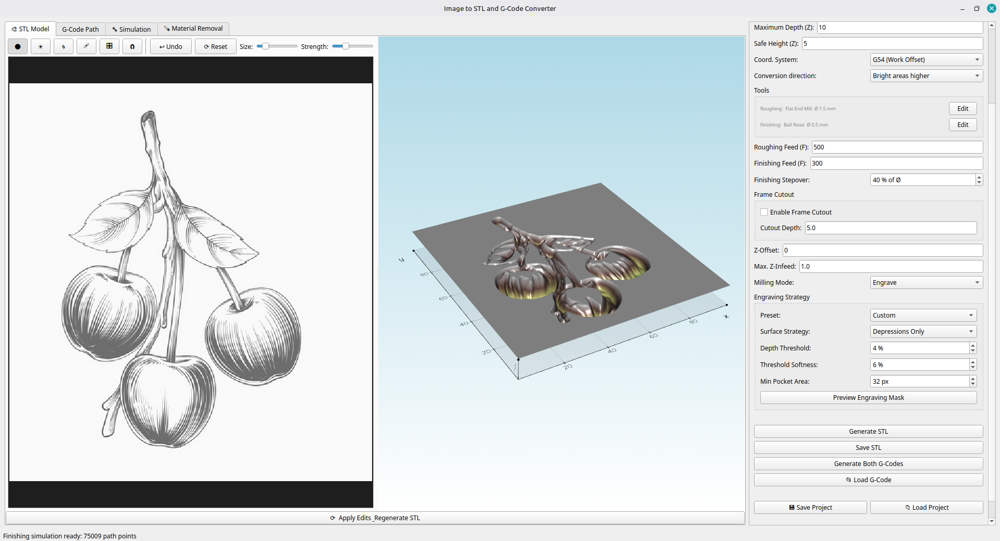

---

### Engraving Strategy / Depressions Only

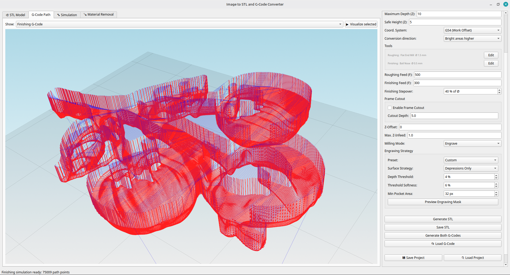

---

### Frame Cutout

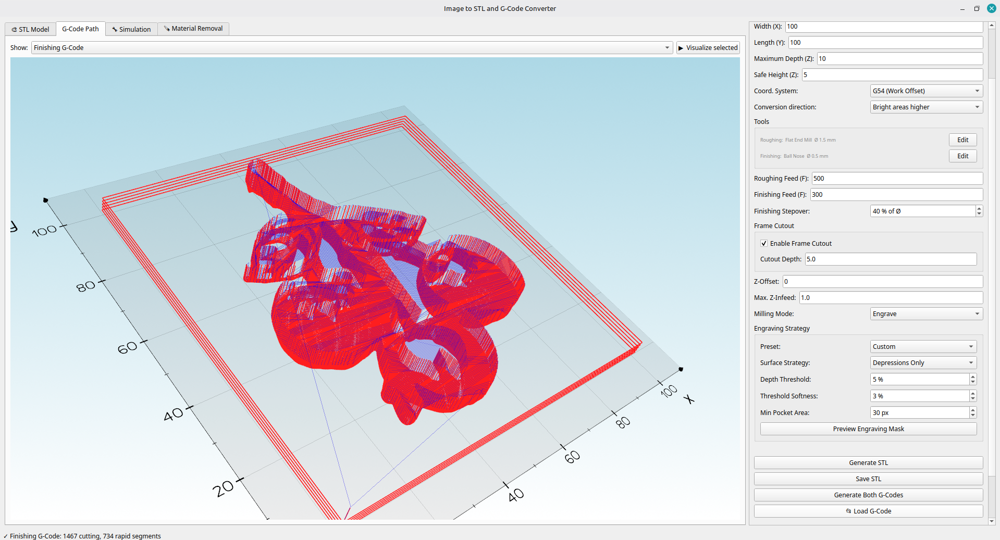

---

### Finishing Stepover & Quality Assistant

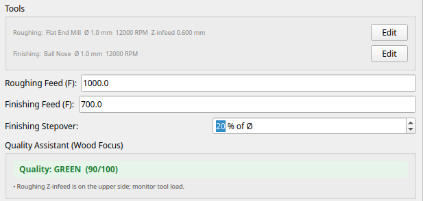

---

### Inlay Mode Panel

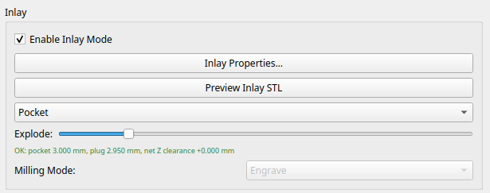

---

### Inlay Properties Dialog

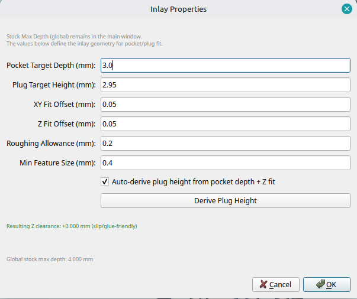

---

### Inlay Preview (Combined View)

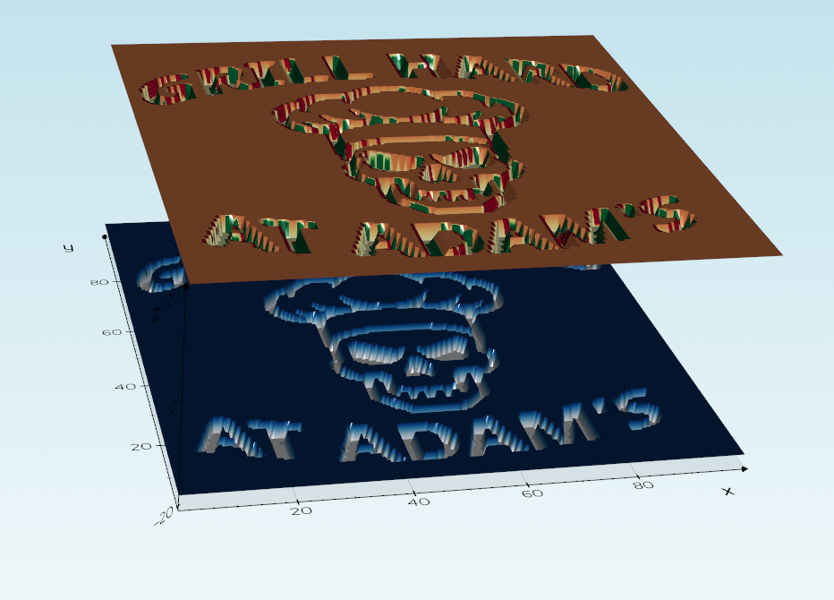

---

### Inlay G-Code Programs

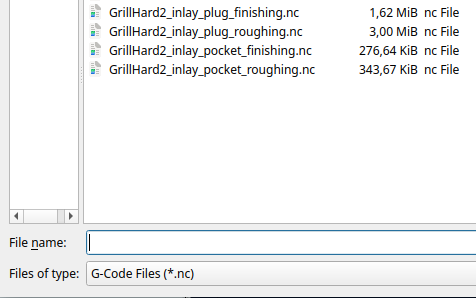

---

---

## Features

- Converts any image to a **height-field STL** model
- Generates **two separate G-Code files** in one step:
  - `*_roughing.nc` – layer-by-layer stock removal with the roughing tool
  - `*_finishing.nc` – single-pass contour tracing with the finishing tool
- Full **3-D tool-path visualization** with feed/rapid distinction
- **Step-by-step NC simulation** with seek slider and play/pause
- **Material removal simulation** to preview the machined surface
- Supports **G54** (work coordinate system offset) and **G92** (machine-origin zeroing)
- **Project files** (`.i2s`) save and restore all settings, both tools and both G-Code programs
- Backward-compatible with old single-tool project files
- **Interactive image editor** with brush tools (darken, brighten, smooth, inpaint, levels, lasso fill) to fix artefacts before conversion
- **Engraving Strategy** with presets, surface-strategy selector (*Full Surface* / *Depressions Only*), depth threshold, softness and minimum pocket area
- **Frame Cutout** – automatically appends a workpiece contour cut to the finishing G-Code
- **Finishing Stepover** as percentage of finishing tool diameter (5-100%) for quality/runtime tradeoff
- **Quality Assistant (Wood Focus)** with live warnings for risky feed/stepover/tool combinations
- **Inlay Mode** (pocket/plug workflow) with dedicated inlay configuration, STL preview modes and 4-file G-Code export

---

---

## Workflow

1. **Load Image** – open any PNG/JPG/BMP image via the top menu or drag-and-drop.
2. **(Optional) Edit Image** – use the Image Editor to remove highlights, artefacts or unwanted areas before conversion.
3. **Set workpiece dimensions** – enter width, length and maximum depth in mm.
4. **Configure tools** – edit the roughing and finishing tools (type, diameter, geometry).
5. **Set feed rates** – enter separate feed rates for roughing and finishing.
6. **Choose milling mode** – *Engrave* or *Relief* (see below).
7. **(Engrave) Configure Engraving Strategy** – select preset, choose *Full Surface* or *Depressions Only*, and tune threshold/softness/min-pocket area. Use the Preview button to check in 3-D.
8. **Set Finishing Stepover** – choose the lateral finishing spacing in `% of Ø` (smaller = better surface, longer runtime).
9. **(Optional) Enable Frame Cutout** – check *Frame Cutout* and set the cutout depth to cut the workpiece free from the stock. Works with or without an image.
10. **(Optional) Enable Inlay Mode** – configure pocket depth / plug height in *Inlay Properties* and preview in *Pocket*, *Plug* or *Combined* view.
11. **Generate STL** – preview the 3-D model on the *STL Model* tab.
12. **Generate Both G-Codes** – creates and saves either 2 standard files or 4 inlay files.
13. **Visualize** – switch to the *G-Code Path* tab and select roughing/finishing (or the inlay variants).
14. **Simulate** – switch to the *Simulation* tab for the step-by-step playback.
15. **Check material removal** – switch to the *Material Removal* tab.
16. **Save Project** – store all settings as a `.i2s` project file for later use.
17. **Machine** – load generated `.nc` files into your CNC controller (e.g. MyCncMill) and run in the intended sequence.

---

---

## Settings Reference

### Workpiece Dimensions

| Setting | Unit | Description |
|---|---|---|
| **Width (X)** | mm | Physical width of the workpiece along the X axis |
| **Length (Y)** | mm | Physical length of the workpiece along the Y axis |
| **Maximum Depth (Z)** | mm | Maximum milling depth; maps to the darkest (or brightest) pixel, depending on direction |
| **Safe Height (Z)** | mm | Z height for all rapid (G0) traverse moves above the workpiece surface; must be high enough to clear all clamps and stock |

### Image Settings

| Setting | Description |
|---|---|
| **Image Smoothing** | Gaussian blur radius in pixels (0 = off). Smooths hard pixel edges before converting to a height map. Useful for low-resolution source images. |
| **Conversion Direction** | **Bright areas higher** – light pixels become peaks, dark pixels become valleys. **Dark areas higher** – inverted mapping. |

### Coordinate System

| Option | Behaviour |
|---|---|
| **G54 (Work Offset)** | The G-Code activates the G54 work coordinate system (`G54` command). The WCS offset must be set once on the machine (e.g. via `G10 L20 P1`) before running the program. This is the recommended approach for repeatable setups. |
| **G92 (Machine Origin)** | Jog the spindle manually to the lower-left corner of the workpiece at the surface (Z = 0) and start the job. The program issues `G92 X0 Y0 Z0` to define that position as the origin on-the-fly. A `G92.1` reset is appended at the end of the program. |

### Tools

Two independent tools can be configured; each has its own tool dialog:

| Parameter | Description |
|---|---|
| **Type** | **Flat End Mill** – flat bottom cutter, ideal for roughing and pocket clearing. **Ball Nose** – hemispherical tip, ideal for smooth 3-D surface finishing. |
| **Cut Diameter (mm)** | Cutting diameter of the tool in mm. The **cutting radius** (= diameter ÷ 2) is derived automatically and used for G-Code cutter-radius compensation. |
| **Cut Length (mm)** | Usable cutting length (flute length) of the tool. |
| **Shank Ø (mm)** | Shank diameter – used for the 3-D tool model in the simulation. |
| **Shank Length (mm)** | Total shank length including holder – used for the 3-D tool model. |

> **Roughing tool** (default: Flat End Mill Ø 3.0 mm) – clears material layer by layer.  
> **Finishing tool** (default: Ball Nose Ø 2.0 mm) – follows the 3-D contour in a single pass.

### Feed Rates

| Setting | Unit | Description |
|---|---|
| **Roughing Feed (F)** | mm/min | Feed rate for all cutting moves in the roughing G-Code |
| **Finishing Feed (F)** | mm/min | Feed rate for all cutting moves in the finishing G-Code |

### Finishing Stepover

| Setting | Unit | Description |
|---|---|---|
| **Finishing Stepover** | % of finishing tool diameter | Lateral distance between finishing raster lines. Lower values improve surface quality but increase machining time. Typical ranges: **10-20%** for fine finish, **30-50%** standard, **60%+** fast/semi-rough finish. |

### Quality Assistant (Wood Focus)

Live advisor that evaluates your current combination of roughing feed, finishing feed, finishing stepover and tool diameter.

- Shows an overall quality state directly in the control panel.
- Emits warnings for combinations that likely produce visible scallops, overload tiny tools, or are too aggressive for clean wood finish.
- Updates continuously while editing parameters.

### Advanced Parameters

| Setting | Unit | Description |
|---|---|
| **Z-Offset** | mm | A constant value added to all Z coordinates. Use to compensate for fixture height or surface irregularities. |
| **Max. Z-Infeed** | mm | Maximum depth per roughing layer. The total depth is divided into this many layers. Smaller values produce more passes and better surface quality; larger values are faster but put more stress on the tool. Does **not** apply to the finishing pass. |

### Milling Mode

| Mode | Description |
|---|---|
| **Engrave** | The relief is carved *into* a flat blank. Pixels are mapped to depth below the surface. The background (deepest level) is fully removed; the image features stand *out* above it. |
| **Relief** | Material is removed *around* the features until the relief remains proud of the surface. The image features are the high points; the background is cut away. |

### Engraving Strategy

Only active when *Engrave* mode is selected. Controls how the depth map is interpreted and filtered before G-Code generation.

| Setting | Description |
|---|---|
| **Preset** | Quick configuration for common use cases. **Wood** – moderate threshold (8 %) and softness (6 %), good all-rounder. **Fine Lines** – low threshold (4 %, 2 %) to preserve thin details. **Deep** – higher contrast for pronounced engravings (12 %, 8 %). **Custom** – manual control. |
| **Surface Strategy** | **Full Surface** – the full height map is engraved across the entire image area. **Depressions Only** – the original surface plane is preserved; only recessed areas (dark pixels) are milled. Produces a gravure-style result where the background is untouched. |
| **Depth Threshold** | Percentage below which a pixel is considered *surface* (no-cut). Lower values = more aggressive cutting; higher values = preserve more surface detail. |
| **Threshold Softness** | Width of the smooth transition around the threshold. Higher % = gradual gradient at edges, lower visible step. 0 = sharp, binary cut-off. |
| **Min Pocket Area** | Smallest pocket area (in pixels) to mill. Isolated artefacts and noise pixels smaller than this size are ignored, preventing tiny inefficient tool movements. |
| **Preview Engraving Mask** | Renders the current engraving settings as a 3-D preview in the STL Model tab so you can fine-tune before generating G-Code. |

### Frame Cutout

Appends a workpiece-outline contour cut at the **end of the finishing G-Code**. The tool circles the perimeter of the workpiece, stepping down in Z-infeed increments until the specified cutout depth is reached. Works independently of the image – can be used with or without a loaded image.

| Setting | Description |
|---|---|
| **Enable Frame Cutout** | Activates the frame cutout pass. |
| **Cutout Depth** | Depth below Z = 0 to cut through (mm). The tool steps down in *Max. Z-Infeed* increments. |

> The tool centre is automatically offset outward by one cutter radius so the cutting edge follows the exact workpiece boundary.

### Inlay Mode

When enabled, Image2STL switches from the normal 2-file workflow to a pocket/plug inlay workflow.

| Setting / Control | Description |
|---|---|
| **Enable Inlay Mode** | Activates inlay validation, preview and multi-program export. |
| **Inlay Properties** | Opens inlay geometry dialog (Pocket Target Depth, Plug Target Height, X/Y fit, Z fit, optional auto-derive for plug height). |
| **Preview Inlay STL** | Shows inlay geometry preview in the STL view. |
| **View Mode (Pocket / Plug / Combined)** | Chooses which inlay body is rendered in preview. |
| **Explode** | Separates pocket and plug visually for easier inspection. |

Inlay defaults to **Engrave** mode and produces four CNC programs (pocket roughing, pocket finishing, plug roughing, plug finishing).

---

---

## Image Editor

The built-in image editor lets you fix artefacts, colour blobs or reflections in the source image **before** converting it to a height map and G-Code.  Open the *Image Editor* tab after loading an image.

### Brush Tools

| Tool | Effect |
|---|---|
| **Darken** | Paint over highlights and reflections to push bright spots darker. |
| **Brighten** | Lift dark artefacts or unwanted dips. |
| **Smooth** | Locally blur colour patches to reduce noise. |
| **Inpaint** | Fill a spot from its surrounding pixel area (ideal for isolated blemishes). |
| **Levels** | Adjust global brightness and contrast with a live preview; confirm or cancel before committing. |
| **Lasso Fill** | Draw a freehand selection around a region, snap vertices to image contours, then fill with a configurable gradient. Supports single-click auto-contour detection. |

Use the **Size** and **Strength** sliders to control brush behaviour. The **Undo** button (Ctrl+Z) steps back through the last 20 strokes. **Reset** restores the original loaded image.

---

---

## G-Code Output

Clicking **Generate Both G-Codes** opens a single save dialog. Both files are saved automatically:

```
my_project_roughing.nc   – roughing program (layer-by-layer raster)
my_project_finishing.nc  – finishing program (single-pass 3-D contour)
```

If **Inlay Mode** is enabled, four files are generated instead:

```text
my_project_inlay_pocket_roughing.nc
my_project_inlay_pocket_finishing.nc
my_project_inlay_plug_roughing.nc
my_project_inlay_plug_finishing.nc
```

**Roughing program structure:**
- Zigzag raster (alternating X direction per Y-line)
- Multiple depth layers in steps of *Max. Z-Infeed*
- G0 rapid retract to *Safe Height* between layers
- Cutter-radius compensation via `maximum_filter`
- Skips passes where the surface is already above the current layer (*Depressions Only* surfaces are respected)

**Finishing program structure:**
- Single-pass zigzag raster following the 3-D surface directly
- No layer splitting – the tool moves along the effective contour
- G0 rapid moves only between raster lines
- Optional **Frame Cutout** appended at the end (contour steps down to the configured cutout depth)

---

---

## Visualization Tabs

### G-Code Path
Displays the parsed tool path of the selected G-Code (roughing or finishing) as coloured 3-D lines:
- **Red** – cutting (feed) moves
- **Blue / transparent** – rapid (G0) traverse moves

Use the dropdown in the toolbar to switch between roughing and finishing paths. The view is cleared on each visualization so only the selected path is shown.

### Simulation
Step-by-step playback of the selected G-Code program with a 3-D tool model.

| Control | Function |
|---|---|
| **Play / Pause** | Start or pause continuous playback |
| **Seek Slider** | Jump to any position in the program |
| **Speed Slider** | Control playback speed |
| **Step Forward / Backward** | Advance or retreat by one move |
| **Setup Simulation** | (Re-)initialize the scene after changing the G-Code or tool |

The side panel shows the currently selected tool's geometry (type, diameter, cut length, shank dimensions).

### Material Removal
Voxel-based simulation of the material removed by the tool following the G-Code path.  
Use the selector to preview the result for the roughing or finishing program independently.

---

---

## Project Files (`.i2s`)

A project file saves:
- Source image path
- All workpiece parameters (dimensions, safe height, feeds, z-step, z-offset, finishing stepover)
- Full roughing tool and finishing tool geometry
- Image smoothing, conversion direction, milling mode, coordinate system
- Engraving strategy settings (preset, surface strategy, threshold, softness, min pocket area)
- Frame cutout settings (enabled flag, cutout depth)
- Inlay settings (enabled flag, geometry/fit config) and inlay G-Code programs
- The full roughing and finishing G-Code programs (so they can be visualized/simulated without regenerating)

Old single-tool `.i2s` files from previous versions are automatically migrated: the original tool is loaded into the roughing slot and the G-Code is loaded into the roughing program.

---

---

## Public Repo Sync (README + Screenshots)

Use the automation script to generate/update the public repository documentation from this private repo:

```bash
python utils/sync_public_docs.py \
  --source-repo /path/to/12_Image2STL_github \
  --public-repo /path/to/Image2STL_MillingCodeGenerator
```

Check mode for CI or pre-release validation:

```bash
python utils/sync_public_docs.py \
  --source-repo /path/to/12_Image2STL_github \
  --public-repo /path/to/Image2STL_MillingCodeGenerator \
  --check
```

The script does three things:

- Transforms this `README.md` into a public variant (commercial banner, public license section, no internal "Related" or build section).
- Copies `docs/screenshots/*` to the public repo.
- Removes stale screenshot files in the public repo that no longer exist in the private repo.

---

---

## Follow & Support

Stay updated with the latest features and community projects:

- **Website:** [www.mycncmill.de](https://www.mycncmill.de) — News, tutorials, and feature announcements
- **Instagram:** [@mycncmill.grbl](https://instagram.com/mycncmill.grbl) — Project showcases and machine builds

Your feedback and contributions help shape Image2STL. Thank you for supporting free CNC software!

---

---

## License

Source code is proprietary. See [LICENSE](LICENSE) for details.  
Contact: [www.mycncmill.de](https://www.mycncmill.de)
